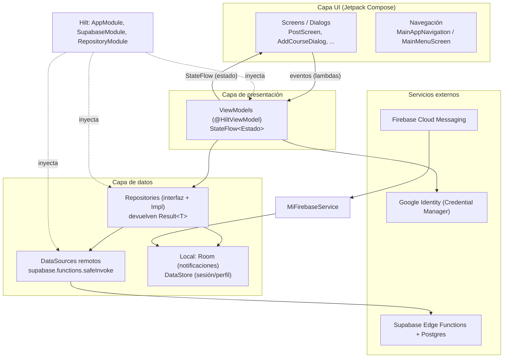
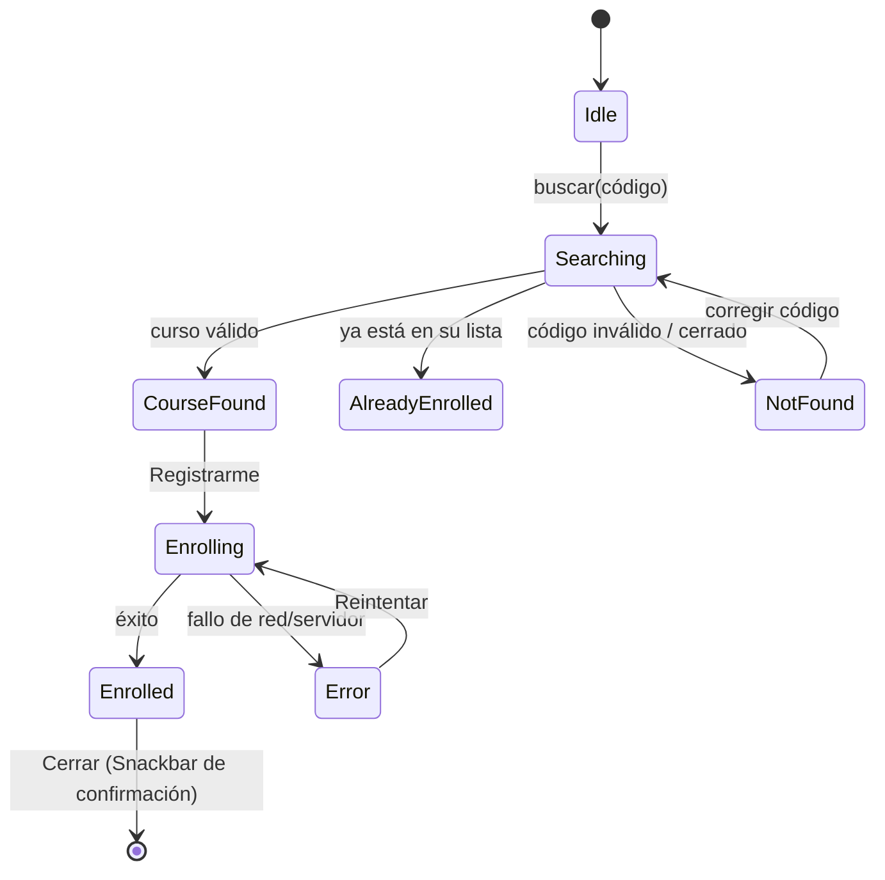
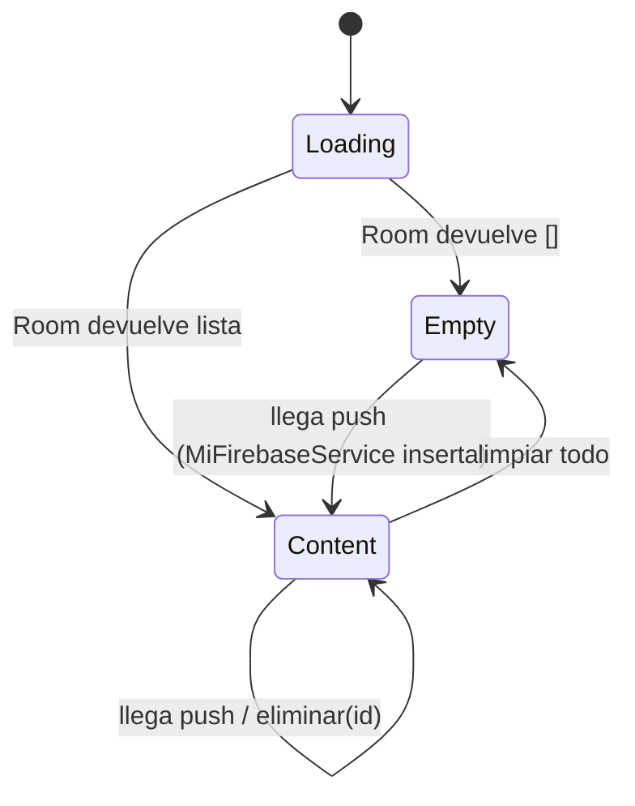
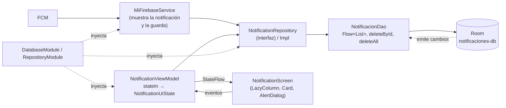

# Examen 1 – 2026B · Introducción al Desarrollo de Nuevas Plataformas (E)

**Proyecto analizado:** AlertaUNI (`com.erns.alertauni`) – Android · Jetpack Compose · Hilt · Supabase · Firebase Cloud Messaging
**Grupo:** B7 — Adrian Issac Mamani Quispe · Daniel Wilston Chura Monroy · Johann Andre Cáceres Ruiz · Daniel Bedregal Pérez · Yourdyy Yossimar Huayhua Hillpa
**Rama de trabajo:** `examen1`

---

## 0. Alcance y metodología

El objetivo es **comprender** el aplicativo entregado, **evaluar y mejorar** funcionalidades existentes y **proponer su evolución** manteniendo la arquitectura actual.

Método seguido:

1. **Lectura estructural**: inventario de paquetes y capas (`screen/`, `navigation/`, `data/`, `domain/`, `services/`, `security/`) y del backend (`Backend/supabase/functions`) junto con el modelo de datos (`Docs/Modelo base datos.png`).
2. **Trazado de casos de uso**: para cada funcionalidad se siguió el camino *acción del usuario → Composable → evento → ViewModel → Repository → DataSource → Edge Function → nuevo estado → recomposición*.
3. **Contraste con el uso real**: cada flujo se evaluó desde la perspectiva de un docente/estudiante real (errores, red lenta, rotación, estados vacíos, permisos, seguridad).
4. **Alcance según el enunciado**:
   - **Punto 2 (evaluación): sólo análisis y propuesta.** No se modificó el código de la app; los fragmentos de código del punto 2 son ilustrativos.
   - **Punto 3 (evolución): desarrollo técnico con implementación parcial** de una propuesta, como evidencia de viabilidad, con el alcance y su justificación explícitos.

> Nota de verificación: el repositorio no incluye `google-services.json` ni las claves reales de Supabase (`SupabaseModule` usa `"https://myurl.supabase.co"`), por lo que la app no puede ejecutarse contra el backend real. El prototipo del punto 3 se verificó compilando el APK (`./gradlew :app:assembleDebug`, incluye Hilt y Room) con un `google-services.json` de prueba no incluido en el repositorio.

---

## 1. Comprensión del aplicativo actual (C3)

### 1.1 Arquitectura general

La app sigue **MVVM con flujo de datos unidireccional (UDF)** y una arquitectura en capas inspirada en la guía oficial de Android:



| Capa | Componentes | Responsabilidad |
|---|---|---|
| UI | `@Composable` screens, `AlertDialog`, `LazyColumn`, `Scaffold`, `NavigationBar`, `FloatingActionButton`, `SnackbarHost` | Dibujar el estado y emitir eventos. Estado efímero de UI con `remember { mutableStateOf() }` (diálogo abierto, texto escrito). |
| Presentación | `LoginViewModel`, `PostViewModel`, `PostCommentViewModel`, `CourseViewModel`, `ContactViewModel` | Mantener el estado con `MutableStateFlow` privado + `StateFlow` público; lanzar corrutinas en `viewModelScope`; sobrevivir a cambios de configuración. |
| Dominio/sesión | `DataStoreHelper` (Preferences DataStore) | Guardar email, nombres, tipo de usuario, token FCM. |
| Datos | `*Repository` (interfaz) + `*RepositoryImpl`; `*DataSource` | El repositorio traduce excepciones a `Result<T>`; el DataSource invoca Edge Functions de Supabase. |
| Infraestructura | Hilt (`@HiltAndroidApp`, `@AndroidEntryPoint`, `@Module`), `SupabaseClient` (Auth + Functions), `MiFirebaseService`, Room | Inyección de dependencias, red, push y persistencia local. |

**Decisiones técnicas relevantes observadas**

- **Inversión de dependencias**: los ViewModels dependen de interfaces (`PostRepository`), enlazadas con `@Binds` en `RepositoryModule`. Permite sustituir la implementación (p. ej. un *fake* para pruebas).
- **Backend como "BFF" en Edge Functions**: la app no consulta tablas directamente (Postgrest está desactivado en `SupabaseModule`), sino funciones como `service-posts`, que validan el perfil (`_shared/auth2.ts`) y filtran por curso.
- **Manejo de errores centralizado**: `Functions.safeInvoke` (`common/Wrappers.kt`) convierte respuestas 401/404 con cuerpo `{code, message}` en `BackendException(BackendError)`.
- **Estados como `sealed class`**: `AuthState`, `PostState`, `CommentState`, `CourseState`, y el genérico `ResourceState<T>` (definido pero no usado).
- **Paso de argumentos por navegación**: `PostCommentViewModel` obtiene `postId` desde `SavedStateHandle`, que Navigation Compose rellena a partir de la ruta `comment/{postId}`.

### 1.2 Arranque y navegación

```mermaid
sequenceDiagram
    actor U as Usuario
    participant A as MainActivity
    participant NAV as MainAppNavigation
    participant L as LoginScreen / LoginViewModel
    participant G as Credential Manager (Google)
    participant SB as Supabase Auth + service-check-profile
    participant M as MainMenuScreen

    A->>NAV: setContent { AlertaUNITheme { MainAppNavigation() } }
    NAV->>L: startDestination = "login"
    U->>L: Toca "Autenticación con Google"
    L->>G: getCredential(GetGoogleIdOption)
    G-->>L: idToken, givenName, familyName
    L->>SB: auth.signInWith(IDToken) → checkProfile()
    alt Perfil existe
        SB-->>L: {user_email, user_type}
        L->>L: DataStore.setUserType(); authState = Authenticated
        L-->>NAV: onLoginSuccess(userType)
        NAV->>M: MainMenuScreen(userType)
    else Perfil no existe (404 PROFILE_NOT_FOUND)
        L->>L: authState = IncompleteProfile
        L-->>NAV: onIncompleteProfile() → navigate("profile")
        U->>NAV: elige Docente/Estudiante → service-update-profile
        NAV->>M: MainMenuScreen(userType)
    end
```

- Hay **dos niveles de navegación**: `MainAppNavigation` (login/perfil) y un segundo `NavHost` dentro de `MainMenuScreen` (pestañas).
- El menú inferior se construye **según el rol**: `PROFESSOR` → Posts, Contactos (docente), Cursos; `STUDENT` → Posts, Contactos (estudiante), Cursos.
- El `FloatingActionButton` es **compartido**: cada pantalla registra su acción con `onFabActionReady { ... }` y el `Scaffold` la ejecuta (patrón de *state hoisting* de la acción).

### 1.3 Funcionalidades identificadas

| # | Funcionalidad | Usuario | Pantalla / ViewModel | Edge Function |
|---|---|---|---|---|
| F1 | Inicio de sesión con Google | Ambos | `LoginScreen` / `LoginViewModel` | Supabase Auth, `service-check-profile` |
| F2 | Completar perfil y elegir rol | Ambos (primera vez) | `ProfileScreen` / `LoginViewModel` | `service-update-profile` |
| F3 | Menú principal por rol | Ambos | `MainMenuScreen` | – |
| F4 | Tablero de anuncios (públicos + privados propios) | Ambos | `PostScreen` / `PostViewModel` | `service-posts` (RPC `get_posts_fun`) |
| F5 | Publicar anuncio a un curso | Docente | `AddPostDialog` / `PostViewModel` | `service-course-catalog`, `service-post-add` |
| F6 | Conversación grupal (comentarios) de un anuncio | Ambos | `PostCommentScreen` / `PostCommentViewModel` | `service-comments`, `service-comment-add` |
| F7 | Anuncio privado docente → estudiante y su hilo privado | Docente / Estudiante | `TeacherContactScreen`, `AddCommentPrivateDialog` / `ContactViewModel` | `service-course-student`, `service-post-private-add` |
| F8 | Contactar por correo al estudiante | Docente | `TeacherContactStudentCard` (Intent `ACTION_SEND`) | – |
| F9 | Ver cursos en los que participa | Ambos | `StudentCourseScreen` / `CourseViewModel` | `service-student-enrollment` |
| F10 | Unirse a un curso con código de clase | Estudiante | `AddCourseDialog` / `CourseViewModel` | `service-find-course-catalog`, `service-course-enroll` |
| F11 | Recepción de notificaciones push y guardado local | Ambos | `MiFirebaseService` + Room (`AppDatabase`) | FCM |
| F12 | Datos de sesión y "Recordar cuenta" | Ambos | `DataStoreHelper`, `SessionRepository` + `CryptoManager` | – |

#### F1 – Inicio de sesión con Google
- **Qué permite**: autenticarse con la cuenta institucional de Google, sin contraseña propia.
- **Componentes**: `CredentialManager` + `GetGoogleIdOption` (Jetpack Credential Manager), `GoogleIdTokenCredential`, `supabaseClient.auth.signInWith(IDToken)`; UI con `Row` clicable, `Image` desde *assets* (`AssetImageLoader`), `Checkbox`.
- **Estado y eventos**: `LoginViewModel` expone `authState: StateFlow<AuthState>` (`Loading`, `Unauthenticated`, `IncompleteProfile`, `CompleteProfile`, `Authenticated`). La pantalla lo observa con `collectAsState()` y reacciona en un `LaunchedEffect(authState.value)` que invoca los callbacks de navegación. El clic se propaga como lambda `btnAutenticar`.
- **Responsabilidades**: la UI sólo dibuja y delega; el ViewModel orquesta Google → Supabase → verificación de perfil y guarda datos en `DataStoreHelper`; `AuthRepositoryImpl` encapsula el SDK de Supabase y traduce `PROFILE_NOT_FOUND` a un evento global (`AppEventManager`).

#### F2 – Completar perfil y rol
- **Qué permite**: en el primer ingreso, confirmar nombres (obtenidos de Google, no editables) y elegir **Docente** o **Estudiante**.
- **Componentes**: `OutlinedTextField(enabled = false)`, `SingleChoiceSegmentedButtonRow` + `SegmentedButton` (Material 3), `Button`.
- **Estado y eventos**: la selección vive en `remember { mutableStateOf() }` dentro de la UI; al confirmar se llama `viewModel.updateUserProfile(...)` y el `LaunchedEffect` espera `AuthState.CompleteProfile` para continuar.
- **Backend**: `service-update-profile` inserta en `user_profile` con `user_type` 1 (docente) o 2 (estudiante).

#### F3 – Menú principal por rol
- `MainMenuScreen(userType)` arma la lista de `RouteMainMenu` según el rol y usa `NavigationBar` + `NavigationBarItem`; la navegación entre pestañas usa `popUpTo(startDestination) { saveState = true }`, `launchSingleTop` y `restoreState`, preservando el estado de cada pestaña.

#### F4 – Tablero de anuncios
- **Qué permite**: ver en orden los anuncios de todos los cursos del usuario, con curso, fecha, autor, visibilidad (Público/Privado) y número de comentarios.
- **Componentes**: `LazyColumn` + `items`, `Card` clicable, `UserInitialCircle`, `SearchBoxComponent` (cabecera).
- **Estado**: `PostViewModel.announcements: StateFlow<List<PostEntity>>`, cargado en `init`. `PostEntity` usa `@Serializable` + `@SerialName` para mapear el JSON.
- **Backend**: `service-posts` obtiene los `course_catalog_id` del usuario (`_shared/tools.ts`: por `professor_id` si es docente o por `student_enrollment` si es estudiante) y llama a la función SQL `get_posts_fun(course_ids, receiver_sender)`, que devuelve los anuncios públicos de esos cursos y los privados donde el usuario es emisor o receptor.

#### F5 – Publicar anuncio (docente)
- **Qué permite**: elegir uno de sus cursos, escribir título y contenido (máx. 280 caracteres) y publicar.
- **Componentes**: `AlertDialog`, `TextField` (con contador y recorte a 280 caracteres en `onValueChange`), selector propio con `OutlinedTextField(readOnly)` + `DropdownMenu` + `DropdownMenuItem`; ancho del menú calculado con `onGloballyPositioned` + `LocalDensity`.
- **Estado y eventos**: estado del formulario en la UI (`remember`); al publicar, `PostScreen` cierra el diálogo y llama `postViewModel.sendPost(...)`, que crea un `PostRequest` e invoca `service-post-add`. El FAB comprueba `catalogCourses` y muestra un `Snackbar` si no hay cursos.

#### F6 – Conversación grupal
- **Qué permite**: abrir un anuncio y conversar con estilo chat (burbujas propias a la derecha).
- **Componentes**: `LazyColumn(reverseLayout = true)`, `Surface` con `RoundedCornerShape` como burbuja, `TextField` con `trailingIcon` de envío.
- **Estado y eventos**: `PostCommentViewModel` recibe `postId` por `SavedStateHandle`; carga `comments` y, al enviar, agrega el comentario localmente (actualización optimista con `_comments.update { it + nuevo }`). `isMine` se calcula en el repositorio comparando el email del autor con el guardado en DataStore.

#### F7 – Anuncio privado y respuesta privada
- **Qué permite**: el docente elige un curso (`FilterChip`), ve la lista de estudiantes y envía a uno de ellos un anuncio privado. Ese anuncio aparece en el tablero **sólo** del docente y del estudiante receptor (filtro `receiver_sender` en `get_posts_fun`) con la etiqueta "Privado"; el hilo de comentarios de ese anuncio funciona como **canal de respuesta privada** del estudiante hacia el docente.
- **Componentes**: `FilterChip`, `LazyColumn`, `IconButton`, `AlertDialog`.
- **Estado**: `ContactViewModel` expone `studentEnrollmentList` y `students`; la selección de curso dispara `LaunchedEffect(courseSelected.value)` → `getStudentByCourse(...)`.

#### F8 – Correo al estudiante
- Toca el email → `Intent.ACTION_SEND` con `type = "message/rfc822"` y `Intent.createChooser`, lanzado con `rememberLauncherForActivityResult(StartActivityForResult)`. Delegar en apps del sistema evita reimplementar correo.

#### F9 y F10 – Cursos e incorporación por código
- **Qué permite**: listar cursos (código, nombre, tipo, grupo, docente) y, con el FAB, buscar un curso por **código de clase** y registrarse.
- **Componentes**: `LazyColumn`, `Card`, `AlertDialog` con `TextField` y botón de búsqueda.
- **Estado (versión original)**: `CourseViewModel` expone `studentEnrollment: StateFlow<StudentEnrollment?>` (curso encontrado) y `courseState` (`Loading/Saved/UnSaved`).
- **Backend**: `service-find-course-catalog` busca en `student_enrollment_view` por `class_code` con `class_code_enable = true` (el docente puede cerrar la inscripción).

#### F11 – Notificaciones push
- `MiFirebaseService` (`FirebaseMessagingService`, `@AndroidEntryPoint`) recibe el token (`onNewToken` → DataStore) y los mensajes (`onMessageReceived`): parsea el cuerpo JSON (`mensaje`, `fechahora`), muestra la notificación (`NotificationChannel` + `NotificationCompat`) y la guarda en Room (`NotificacionEntity`).
- **Comportamiento oculto**: las notificaciones se **persisten pero no existe ninguna pantalla que las muestre** (`NotificacionesViewModel` no se usaba). Esta observación motivó la funcionalidad del punto 3.

#### F12 – Sesión
- `DataStoreHelper` (Preferences DataStore, `@Singleton`) persiste perfil y preferencias. `SessionRepository` + `CryptoManager` implementan cifrado AES/GCM con **Android Keystore** para tokens, pero no están conectados al flujo actual.

### 1.4 Hallazgos del análisis (defectos, código muerto y riesgos)

Identificar estas situaciones forma parte de comprender el aplicativo. El punto 2 **propone** cómo resolver las de mayor impacto; sólo H1, H5 y H6 se corrigieron porque el prototipo del punto 3 los necesita para funcionar.

| # | Hallazgo | Ubicación | Impacto | Estado |
|---|---|---|---|---|
| H1 | `MainAppNavigation()` se llamaba **dos veces** (dentro y fuera del `Scaffold`) → dos `NavHost` y dos pantallas de login superpuestas | `MainActivity.kt` | Alto (UI duplicada, doble ViewModel) | Corregido (necesario para el prototipo del punto 3) |
| H2 | Al publicar un anuncio la lista **no se refresca**; no hay estado de carga, vacío ni error; un curso sin anuncios se trataba como error (`"No posts found"`) | `PostViewModel`, `PostRepositoryImpl` | Medio | Propuesta (Mejora 2) |
| H3 | Unirse a curso: sin indicador de carga, errores silenciosos (sólo `Log`), el código escrito se borra, se puede pulsar "Registrarme" sin curso, no detecta "ya registrado" | `AddCourseDialog`, `CourseViewModel` | Alto (flujo crítico) | Propuesta (Mejora 1)¹ |
| H4 | El FAB de "Posts" y "Cursos" aparece para **ambos roles** (un estudiante podía abrir "Nuevo anuncio" y un docente "Agregar curso") | `MainMenuScreen` | Medio | Propuesta (Mejora 2)¹ |
| H5 | Android 13+ requiere el permiso `POST_NOTIFICATIONS` en tiempo de ejecución; no estaba declarado ni solicitado (`targetSdk = 36`) | `AndroidManifest.xml` | Alto (no se ven notificaciones) | Corregido (parte del prototipo del punto 3) |
| H6 | `MiFirebaseService` construía una **nueva base Room por cada mensaje** y usaba `CoroutineScope` sin cancelar | `MiFirebaseService` | Medio (recursos) | Corregido (parte del prototipo del punto 3) |
| H7 | `CourseDataSource` invoca `GET_COMMENTS` en lugar del catálogo de cursos | `CourseDataSource.kt` | Bajo (no se usa) | Documentado |
| H8 | "Recordar cuenta" se guarda pero nunca se lee (`checkSession2` es privado y no se invoca); `init` borra `userType` en cada inicio | `LoginViewModel` | Medio | Documentado |
| H9 | Nombre del docente **fijo** ("Ernesto Suarez") en la cabecera de Contactos | `TeacherContactScreen` | Bajo | Documentado |
| H10 | `StudentContactScreen` está vacía | `StudentContactScreen.kt` | Medio | Propuesta (punto 3) |
| H11 | `UserInitialCircle` genera un color aleatorio **en cada recomposición** (parpadeo) | `UserInitialCircle.kt` | Bajo | Documentado |
| H12 | Código heredado sin uso: `AppNavigation`, `HomeScreen`, APIs Retrofit, `AuthInterceptor`, `FirebaseTokenProvider`, `ResourceState` | varios | Mantenibilidad | Documentado |
| H13 | **Seguridad**: el propio usuario elige su rol "Docente" en `service-update-profile`; cualquier cuenta podría declararse docente | Backend | Alto | Propuesta |
| H14 | `service-course-student` no verifica que quien consulta sea el docente del curso (exposición de datos de estudiantes) | Backend | Alto | Propuesta |
| H15 | `service-post-add` referencia `courseCatalogIDs` sin declararlo y su `catch` usa `error` en vez de `err` → la función falla; `service-comments` desestructura `dbError` (inexistente) | Backend | Alto | Documentado |
| H16 | Faltan en el repositorio `service-student-enrollment`, `service-course-enroll` y `service-comment-add-private` | Backend | – | Documentado |

¹ El flujo de incorporación a un curso (H3) y el botón "+" de Cursos sólo para estudiantes se implementaron después como parte de otro entregable, el **Proyecto Integrador – Parte 1** (`Docs/Proyecto01`), no como parte de este examen.

---

## 2. Evaluación y mejora de funcionalidades existentes (C2)

> **Alcance:** esta actividad es de **análisis y propuesta**; no se modificó el código de la app. Para cada mejora se describen el problema, el comportamiento esperado, los recursos propuestos y cómo se integrarían en la arquitectura. Los fragmentos de código son **ilustrativos**.

### Mejora 1 – Incorporación a un curso con estados explícitos

**Problema identificado.** El flujo de unirse a un curso (F10) es la puerta de entrada del estudiante y, en la versión original:

- No había indicador de búsqueda ni de registro en curso: el usuario no sabía si la app estaba trabajando.
- Los errores (código inválido, inscripción cerrada, sin red) sólo se registraban con `Log.d`: **el usuario no recibía ningún mensaje**.
- El texto escrito se borraba al buscar, obligando a reescribir un código mal tipeado.
- El botón "Registrarme" estaba habilitado aunque no hubiera curso encontrado y podía pulsarse varias veces (doble petición).
- Un estudiante ya inscrito podía intentar registrarse de nuevo.
- El estado vivía repartido en tres lugares (`studentEnrollment`, `courseState` y variables `remember` en la pantalla) que se copiaban entre sí con `LaunchedEffect { collect { ... } }`.

**Comportamiento esperado.** El diálogo debe reflejar en todo momento en qué punto del proceso está el usuario:



**Recursos de Android/Compose propuestos y justificación**

| Recurso | Uso | Por qué es apropiado | Restricciones consideradas |
|---|---|---|---|
| `sealed class EnrollUiState` | Estados `Idle`, `Searching`, `CourseFound`, `NotFound`, `AlreadyEnrolled`, `Enrolling`, `Enrolled`, `Error` | Modela estados **mutuamente excluyentes**; el `when` exhaustivo obliga a tratar cada caso y elimina combinaciones imposibles (p. ej. "cargando" y "error" a la vez) | Cada estado nuevo exige actualizar la UI (ventaja: el compilador lo señala) |
| `StateFlow` en el ViewModel + `collectAsState()` | Fuente única de verdad del proceso | Sobrevive a la rotación (el ViewModel no se destruye); Compose se recompone sólo cuando cambia el estado | `StateFlow` descarta valores iguales consecutivos, por eso los estados son `data class`/`object` distintos |
| `rememberSaveable` | Texto del código y visibilidad del diálogo | A diferencia de `remember`, se conserva tras rotación o muerte del proceso | Sólo admite tipos guardables en `Bundle` (aquí `String`/`Boolean`) |
| `CircularProgressIndicator` | En el campo (buscando) y en el botón (registrando) | Retroalimentación inmediata sin bloquear la pantalla completa | – |
| `KeyboardOptions(imeAction = Search, capitalization = Characters)` + `KeyboardActions` | Buscar desde el teclado; mayúsculas para códigos | Reduce errores de tipeo y pasos | La mayúscula es sugerencia del teclado, no se fuerza en el dato |
| `TextField(isError = ...)` | Resalta el campo ante código inválido | Patrón estándar de Material 3 para validación | – |
| `SnackbarHostState.showSnackbar` en `LaunchedEffect` | Confirma el registro aun después de cerrar el diálogo | Mensaje no intrusivo y accesible | Se dispara al entrar al estado `Enrolled` |
| Validación local (lista de inscripciones) | Detecta "ya registrado" sin llamar al servidor | Ahorra una petición y da un mensaje preciso | El servidor debe seguir validando (clave primaria en `student_enrollment`) |
| `@Preview` por estado | Una vista previa por estado del diálogo | Permite revisar cada estado sin backend y contrastarlo con el prototipo | – |

**Integración con la arquitectura (propuesta).** No haría falta modificar repositorios ni DataSources: el cambio se concentraría en la capa de presentación, respetando las responsabilidades:

- **UI** (`AddCourseDialog`): recibiría un `EnrollUiState` y emitiría `onClickFindCourse(código)` / `onClickCourseEnroll()`. Sería *stateless* respecto al proceso (sólo guarda el texto escrito), por eso admitiría `@Preview`.
- **ViewModel** (`CourseViewModel`): normalizaría el código (`trim`), evitaría peticiones duplicadas, decidiría el estado y traduciría `BackendException` a mensajes de usuario.

```kotlin
// Ilustrativo: estado único del proceso expuesto por CourseViewModel
sealed class EnrollUiState {
    object Idle : EnrollUiState()
    object Searching : EnrollUiState()
    data class CourseFound(val course: StudentEnrollment) : EnrollUiState()
    data class NotFound(val message: String) : EnrollUiState()
    data class AlreadyEnrolled(val course: StudentEnrollment) : EnrollUiState()
    data class Enrolling(val course: StudentEnrollment) : EnrollUiState()
    data class Enrolled(val course: StudentEnrollment) : EnrollUiState()
    data class Error(val message: String, val course: StudentEnrollment?) : EnrollUiState()
}
```
- **Repository/DataSource**: sin cambios (`StudentRepository.findCourse`, `courseEnroll`).

Archivos que se modificarían: `screen/course/CourseViewModel.kt`, `screen/course/AddCourseDialog.kt`, `screen/course/StudentCourseScreen.kt`.

> Esta propuesta se retomó y amplió (QR, validación contra la lista de matriculados) en el **Proyecto Integrador – Parte 1**; su implementación pertenece a ese entregable.

### Mejora 2 – Tablero de anuncios confiable (actualización, estados y rol)

**Problema identificado.**

- Tras publicar, **el anuncio nuevo no aparece** hasta reiniciar la app (el ViewModel sólo carga en `init`), y el docente no recibe confirmación ni aviso de error.
- No hay forma de **actualizar manualmente** para ver anuncios nuevos de otros.
- Sin estado de carga, ni mensaje de "sin anuncios", ni mensaje de error: todas las situaciones se ven como una pantalla vacía. Además, un curso sin anuncios se trataba como **error** en el repositorio.
- Las tarjetas tenían **altura fija (220 dp)**, cortando contenidos largos o dejando espacio vacío.
- El FAB de publicación se mostraba también al **estudiante**.

**Comportamiento esperado.** Carga inicial con indicador → lista, estado vacío o error con posibilidad de reintentar deslizando hacia abajo → al publicar, Snackbar "Anuncio publicado" y la lista se actualiza sola. Sólo el docente ve el botón de publicar.

**Recursos propuestos y justificación**

| Recurso | Uso | Justificación | Restricciones |
|---|---|---|---|
| `data class BoardUiState(posts, isLoading, isRefreshing, errorMessage)` | Estado único del tablero | Un solo objeto inmutable actualizado con `update { copy(...) }` evita estados inconsistentes y conserva los anuncios ya cargados si falla una actualización | – |
| `PullToRefreshBox` (Material 3, `@ExperimentalMaterial3Api`) | Deslizar para actualizar | Gesto conocido por los usuarios; se integra con `LazyColumn` | API experimental: puede cambiar entre versiones de Material 3 (el BOM 2025.02 incluye Material 3 1.3.x, donde ya existe) |
| `MutableSharedFlow<String>` (eventos) | Mensajes de un solo disparo para el Snackbar | Un `StateFlow` re-emitiría el último mensaje tras rotar; `SharedFlow` sin *replay* modela correctamente un evento | Si nadie está suscrito el evento se descarta (`extraBufferCapacity = 1` mitiga el caso de emisión rápida) |
| `LazyColumn` con `key = { it.id }` | Lista de anuncios | Mantiene la identidad de cada ítem al insertar uno nuevo arriba (animaciones y estado correctos) | Requiere ids únicos (`post_id` lo es) |
| `Text(maxLines = 4, overflow = Ellipsis)` y altura según contenido | Tarjeta de anuncio | Tarjetas legibles de altura variable; el detalle completo se ve al abrir el anuncio | – |
| Visibilidad del FAB por rol en `MainMenuScreen` | Docente: FAB en Posts; Estudiante: FAB en Cursos | La acción disponible coincide con los permisos del rol | La restricción real debe estar también en el backend (ver H13) |

**Integración con la arquitectura (propuesta).** `PostRepositoryImpl.getPosts()` debería devolver `Result.success(emptyList())` cuando no hay anuncios (un caso válido, no un error). `PostViewModel` agregaría `refresh()` y, al publicar con éxito, emitiría el mensaje y volvería a cargar la lista. `PostScreen` observaría `boardUiState` y `messages`; los Composables de presentación (`BoardLayout`, `AnnounceList`, `MessageCard`) seguirían recibiendo sólo datos y lambdas.

```kotlin
// Ilustrativo: PostViewModel
data class BoardUiState(
    val posts: List<PostEntity> = emptyList(),
    val isLoading: Boolean = true,
    val isRefreshing: Boolean = false,
    val errorMessage: String? = null
)

private val _messages = MutableSharedFlow<String>(extraBufferCapacity = 1) // eventos de un solo disparo

fun sendPost(courseId: String, title: String, content: String) = viewModelScope.launch {
    repository.sendPost(PostRequest(courseId, title, content, false, true))
        .onSuccess { _messages.emit("Anuncio publicado"); getPost() } // la lista se actualiza sola
        .onFailure { _messages.emit("No se pudo publicar el anuncio") }
}
```

```kotlin
// Ilustrativo: PostScreen
PullToRefreshBox(isRefreshing = state.isRefreshing, onRefresh = viewModel::refresh) {
    when {
        state.isLoading -> CircularProgressIndicator()
        state.posts.isEmpty() -> EmptyOrErrorMessage(state.errorMessage)
        else -> AnnounceList(state.posts)
    }
}
```

Archivos que se modificarían: `screen/post/PostViewModel.kt`, `screen/post/PostScreen.kt`, `data/repository/PostRepositoryImpl.kt`, `navigation/MainAppNavigation.kt`.

### Otras mejoras recomendadas

1. **Rol verificado por el servidor (H13)**: el rol "Docente" no debería autodeclararse. Propuesta: tabla `professor` precargada por la escuela o validación por dominio/lista; la Edge Function asigna el rol y la app sólo lo lee.
2. **Autorización en `service-course-student` (H14)** y políticas RLS en Supabase para que un docente sólo vea estudiantes de sus cursos.
3. **Comentarios en tiempo real**: el SDK `realtime-kt` ya es dependencia; el ViewModel podría suscribirse a `postgresChangeFlow` de la tabla `comment` filtrando por `post_id`, en lugar de cargar una sola vez.
4. **"Recordar cuenta" (H8)**: leer `REMEMBER_ME` y la sesión de Supabase al iniciar para saltar el login.

---

## 3. Evolución del aplicativo (C1)

### Propuestas

| # | Propuesta | Necesidad que atiende |
|---|---|---|
| P1 | **Bandeja de avisos** (historial de notificaciones) – *desarrollada técnicamente, con implementación parcial* | Las notificaciones push desaparecen al descartarlas; el estudiante pierde avisos importantes (cambios de horario, fechas de entrega). La app ya las guardaba en Room, pero no había dónde verlas. |
| P2 | **Consultas privadas del estudiante al docente** | Hoy sólo el docente inicia la comunicación privada; `StudentContactScreen` está vacía. El estudiante debería poder elegir un curso y enviar una consulta privada a su docente (reutilizando `service-post-private-add` con `receiver_private = professor_id`). |
| P3 | **Confirmación de lectura de anuncios** ("Visto por 23 de 30") | El docente no sabe si un comunicado importante fue leído. Requiere tabla `post_read(post_id, user_id, read_at)` y registrar la lectura al abrir el anuncio. |
| P4 | **Unirse al curso escaneando un QR** | Escribir el código de clase genera errores. El proyecto ya incluye `com.google.zxing:core`; el docente mostraría el QR del `class_code` y el estudiante lo escanearía con CameraX + ML Kit. |

### Desarrollo técnico de P1 – Bandeja de avisos

**Necesidad.** Una notificación push es efímera: si el estudiante la descarta o el sistema la agrupa, el aviso se pierde. En un contexto académico (cambios de aula, fechas de examen) esto es crítico. La app ya recibía y guardaba los avisos en Room, pero **ningún componente los mostraba**.

**Comportamiento esperado (usuario).**
1. Nueva pestaña **"Avisos"** en el menú inferior (docente y estudiante).
2. Lista de avisos del más reciente al más antiguo, con título, mensaje y fecha.
3. Si llega una notificación con la pantalla abierta, aparece **sin recargar**.
4. Puede eliminar un aviso o limpiar todos (con confirmación).
5. Estado vacío con explicación cuando no hay avisos.
6. Al entrar por primera vez en Android 13+ se solicita el permiso de notificaciones.

**Evaluación y selección de recursos**

| Necesidad técnica | Alternativas evaluadas | Seleccionado | Justificación y restricciones |
|---|---|---|---|
| Persistir avisos en el dispositivo | Preferences DataStore · Room · sólo servidor | **Room** (ya existente) | DataStore guarda pares clave-valor, no listas consultables; el servidor exigiría red para ver el historial. Room permite ordenar, borrar por id y **observar cambios**. Restricción: el historial es por dispositivo (no se sincroniza entre equipos). |
| Observar cambios | `LiveData` (original) · `Flow` | **`Flow` desde el DAO** | Se integra con corrutinas y `StateFlow`, que es el estándar del resto del proyecto; `LiveData` depende del ciclo de vida y era el único caso en la app. |
| Exponer estado a la UI | `Flow` directo · `stateIn` | **`stateIn(viewModelScope, WhileSubscribed(5000), Loading)`** | Convierte el Flow en `StateFlow` con valor inicial; deja de observar Room 5 s después de salir de la pantalla (ahorra recursos) y no reinicia la consulta en una rotación. |
| Una sola instancia de base de datos | `Room.databaseBuilder` en cada uso (original) · Hilt `@Singleton` | **`DatabaseModule` de Hilt** | Abrir varias instancias de la misma base es costoso y puede causar inconsistencias; con Hilt el servicio FCM y el ViewModel comparten la misma. |
| Escribir desde el servicio | `CoroutineScope` suelto · scope del servicio | **`CoroutineScope(SupervisorJob() + Dispatchers.IO)` cancelado en `onDestroy`** | Evita corrutinas huérfanas; I/O fuera del hilo principal. |
| Mostrar notificaciones | Sin permiso · `POST_NOTIFICATIONS` | **Permiso en manifiesto + `RequestPermission`** | Obligatorio con `targetSdk ≥ 33`; si el usuario lo niega, los avisos igual se guardan en la bandeja. |
| Lista y acciones | `Column` · `LazyColumn` | **`LazyColumn` con `key`**, `Card`, `IconButton`, `AlertDialog` de confirmación | Carga perezosa y estabilidad de ítems al borrar. |

**Estados y eventos**



- Estado: `NotificationUiState` = `Loading` | `Empty` | `Content(notifications)`.
- Eventos de UI → ViewModel: `deleteNotification(id)`, `clearAll()` (tras confirmar en `AlertDialog`).
- Evento externo: `onMessageReceived` → `NotificationRepository.saveNotification(...)` → Room emite → la UI se recompone.

**Responsabilidades por capa**



| Componente | Responsabilidad |
|---|---|
| `NotificationScreen` / `NotificationScreenLayout` | Dibujar Loading/Empty/Content; confirmar "Limpiar todo"; emitir eventos. `NotificationScreenLayout` es *stateless* (tiene `@Preview`). |
| `NotificationViewModel` | Transformar el Flow de Room en `NotificationUiState`; ejecutar eliminaciones en `viewModelScope`. |
| `NotificationRepository` + `Impl` | Aislar a la UI y al servicio de Room (misma convención interfaz + `@Binds` que el resto de repositorios). |
| `NotificacionDao` | Consultas SQL: observar ordenado por fecha, borrar uno, borrar todos. |
| `DatabaseModule` | Proveer `AppDatabase` como `@Singleton` y el DAO. |
| `MiFirebaseService` | Recibir el push, mostrarlo y delegar el guardado al repositorio. |
| `MainMenuScreen` / `RouteMainMenu.Notifications` | Nueva pestaña "Avisos" y solicitud del permiso. |

**Integración con la arquitectura actual.** La funcionalidad reutiliza la entidad y la base Room existentes (sin migración de esquema: no se cambiaron columnas) y sigue exactamente los mismos patrones del proyecto: `@HiltViewModel`, repositorio con interfaz enlazado con `@Binds`, `StateFlow` observado con `collectAsState()`, pestaña registrada en `RouteMainMenu` y `NavHost` del menú. Se eliminó `data/local/NotificacionesViewModel.kt`, que estaba en la capa de datos, usaba `LiveData` y creaba la base manualmente.

**Alcance del prototipo (implementación parcial) y justificación**

El enunciado no exige desarrollar la funcionalidad completa, sino evidencia técnica suficiente de que es viable. Por eso se implementó **sólo la parte de mayor riesgo técnico**: la integración FCM → Room → ViewModel → Compose, que es la que podría impedir la propuesta. El resto son extensiones incrementales sobre esa base.

| Implementado (evidencia de viabilidad) | No implementado (trabajo futuro) | Por qué se dejó fuera |
|---|---|---|
| Pestaña "Avisos" con estados Carga / Vacío / Lista | Marcar avisos como leídos y contador de no leídos en la pestaña | Requiere una columna nueva y una **migración de Room**; no aporta evidencia adicional de viabilidad |
| Lista que se actualiza sola al llegar un push (`Flow` de Room) | Abrir el anuncio relacionado al tocar un aviso | Requiere que el backend envíe el `post_id` en el push (cambio en el emisor) |
| Eliminar un aviso y limpiar todos (con confirmación) | Envío de mensajes FCM de tipo *data* desde el backend | Cambio en el servidor, fuera del alcance de la app |
| Base Room única con Hilt y permiso `POST_NOTIFICATIONS` (prerrequisitos para que el prototipo funcione) | Sincronizar el historial entre dispositivos | Requiere una tabla y un endpoint nuevos en Supabase |
| `@Preview` de los estados | Limpieza periódica con WorkManager | Optimización posterior |

Las correcciones H1 (NavHost duplicado), H5 (permiso de notificaciones) y H6 (base Room única) forman parte de este prototipo: sin ellas la pestaña nueva no podría probarse correctamente.

**Restricciones y limitaciones conocidas**

- **Mensajes FCM de tipo *notification* en segundo plano**: si la app está en segundo plano, Android muestra la notificación sin llamar a `onMessageReceived`, por lo que **no se guardaría**. Para garantizar el historial, el backend debe enviar mensajes **de datos** (`data` payload) o combinados. Es un cambio en el emisor, no en la app.
- **Historial local**: se pierde al desinstalar y no se comparte entre dispositivos. Una versión futura podría sincronizar con una tabla `notification` en Supabase.
- **Crecimiento**: sin límite de registros; podría añadirse una limpieza periódica (p. ej. avisos de más de 90 días) con WorkManager.

Archivos del prototipo: `MainActivity.kt` (H1), `screen/notification/NotificationScreen.kt`, `screen/notification/NotificationViewModel.kt`, `data/repository/NotificationRepository.kt`, `data/repository/NotificationRepositoryImpl.kt`, `data/di/DatabaseModule.kt`, `data/local/NotificacionDao.kt`, `services/MiFirebaseService.kt`, `navigation/RouteMainMenu.kt`, `navigation/MainAppNavigation.kt`, `AndroidManifest.xml`.

---

## 4. Resumen de cambios en el código del examen

| Actividad | Cambios en el código | Detalle |
|---|---|---|
| 1. Comprensión | Ninguno | Sólo análisis |
| 2. Evaluación (Mejoras 1 y 2) | **Ninguno** | Sólo análisis y propuesta; fragmentos ilustrativos en el informe |
| 3. Evolución (P1 Bandeja de avisos) | Implementación **parcial** | `screen/notification/*`, `NotificationRepository*`, `DatabaseModule`, `NotificacionDao`, `MiFirebaseService`, `RouteMainMenu`, `MainAppNavigation` (pestaña + permiso), `AndroidManifest.xml`, `MainActivity` (H1) |

> Los cambios en `screen/course/*`, `domain/course/*` y el backend nuevo pertenecen al **Proyecto Integrador – Parte 1**, no a este examen.

---

## 5. Guía para la sustentación

Preguntas probables y dónde está la respuesta:

- *¿Por qué `StateFlow` y no `mutableStateOf` en el ViewModel?* → El ViewModel no depende de Compose; `StateFlow` es observable desde cualquier capa y se convierte en estado de Compose con `collectAsState()` (§1.1).
- *¿Qué diferencia hay entre `remember` y `rememberSaveable`?* → `rememberSaveable` sobrevive a rotación/muerte del proceso guardando en `Bundle` (Mejora 1).
- *¿Por qué `SharedFlow` para el Snackbar?* → Es un evento de un solo disparo; un `StateFlow` lo repetiría (Mejora 2).
- *¿Cómo llega `postId` al ViewModel de comentarios?* → Argumento de la ruta `comment/{postId}` → `SavedStateHandle` (F6).
- *¿Cómo se decide qué anuncios ve cada usuario?* → `service-posts` + `get_posts_fun(course_ids, receiver_sender)` (F4, F7).
- *¿Qué hace Hilt aquí?* → Provee `SupabaseClient`, `DataStoreHelper`, `AppDatabase` como singletons y enlaza interfaces de repositorio con `@Binds` (§1.1, P1).
- *¿Qué limitaciones tiene la bandeja?* → Mensajes *notification* en segundo plano, historial local (§3, restricciones).
- *¿Por qué no implementaron las mejoras del punto 2?* → El enunciado pide analizarlas y proponerlas; se justificó cada una con problema, comportamiento esperado, recursos e integración (§2).
- *¿Por qué la bandeja está incompleta?* → Implementación parcial deliberada: se probó la parte de mayor riesgo (FCM → Room → Compose); lo demás es incremental (§3, alcance del prototipo).
- *¿Qué riesgos de seguridad encontraron?* → Rol autodeclarado y consulta de estudiantes sin autorización (H13, H14).
