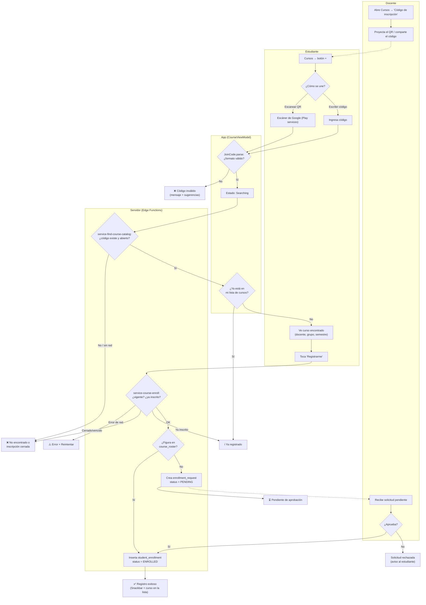
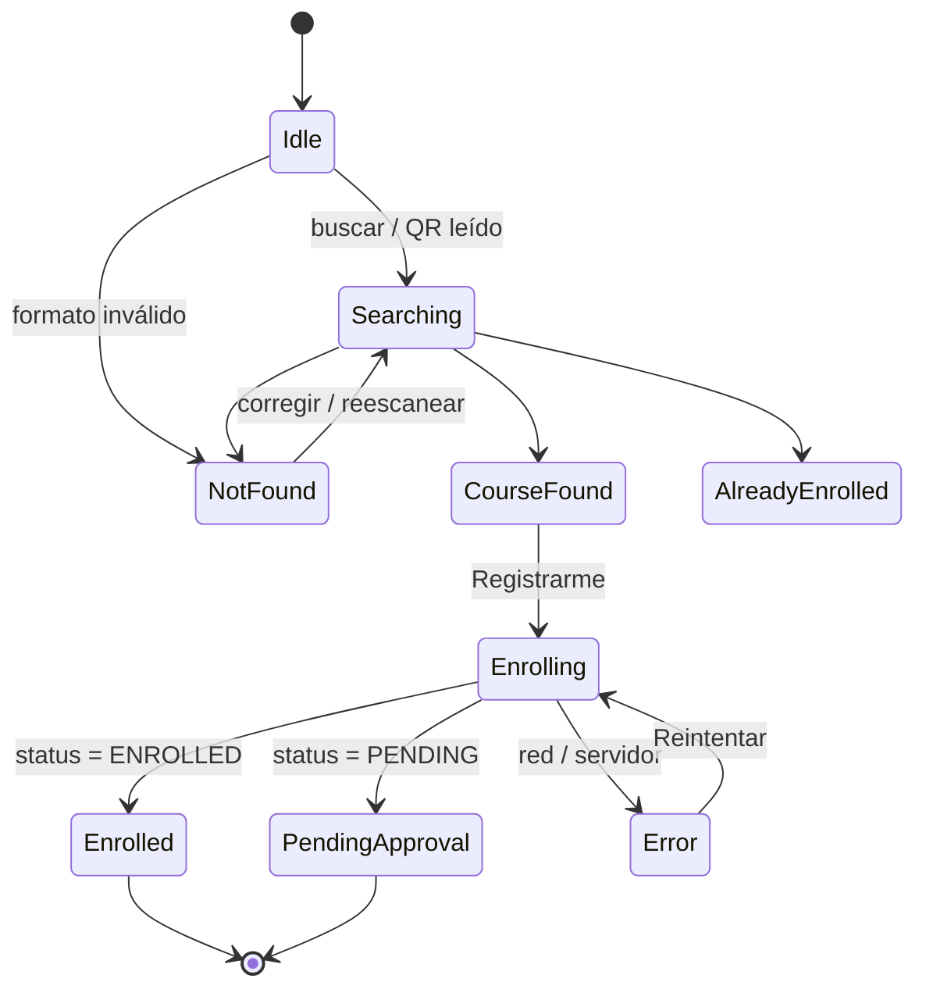
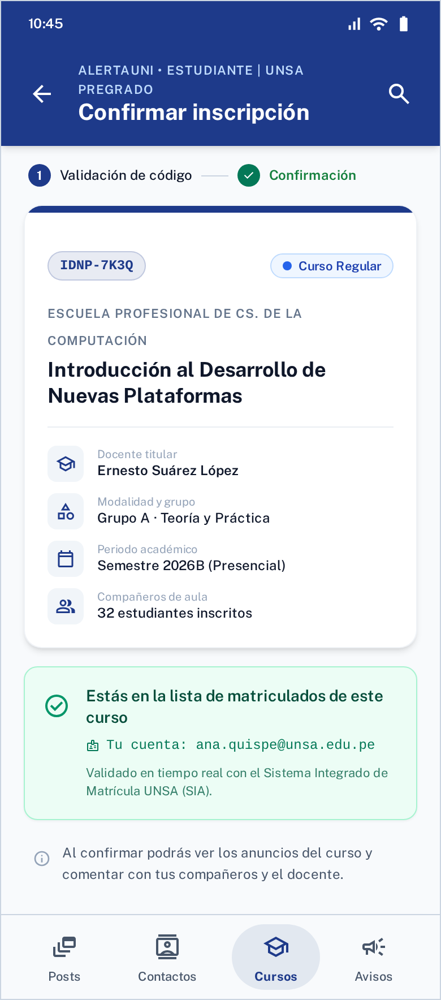
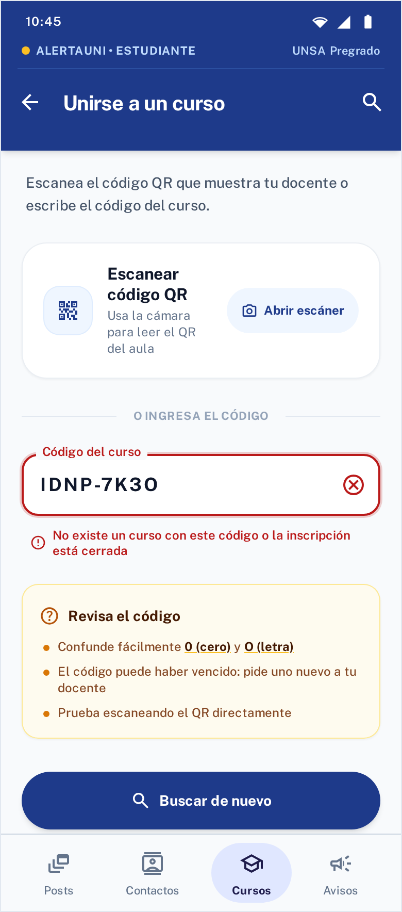
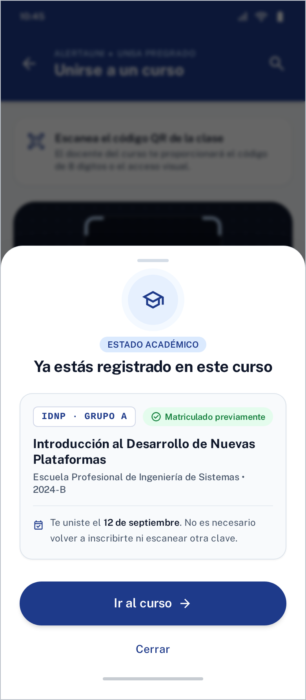
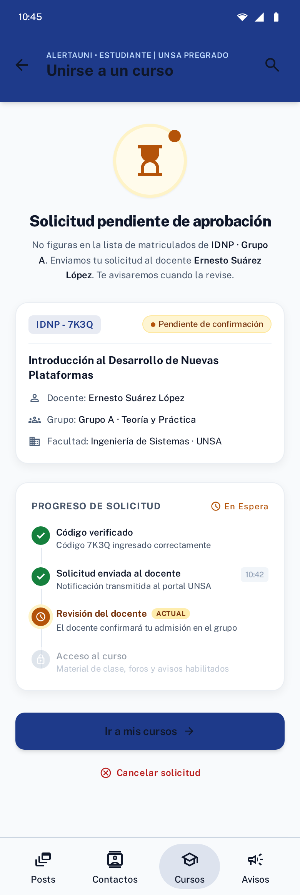
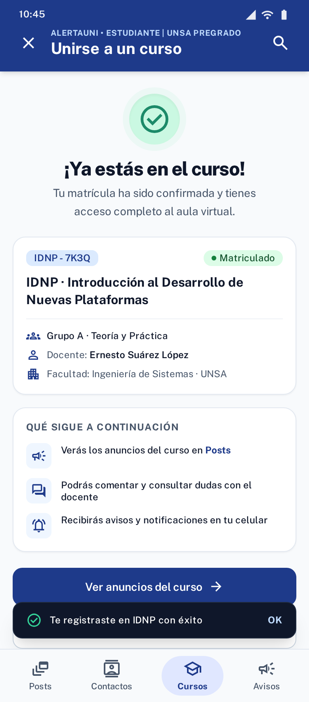
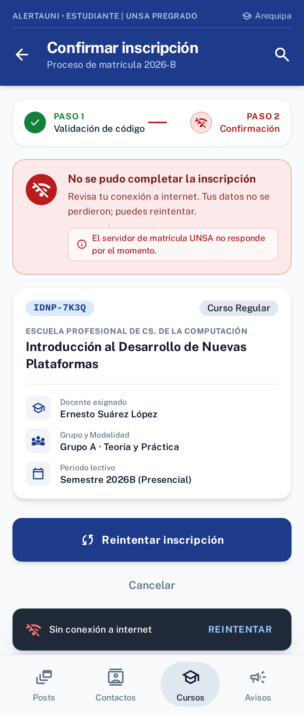
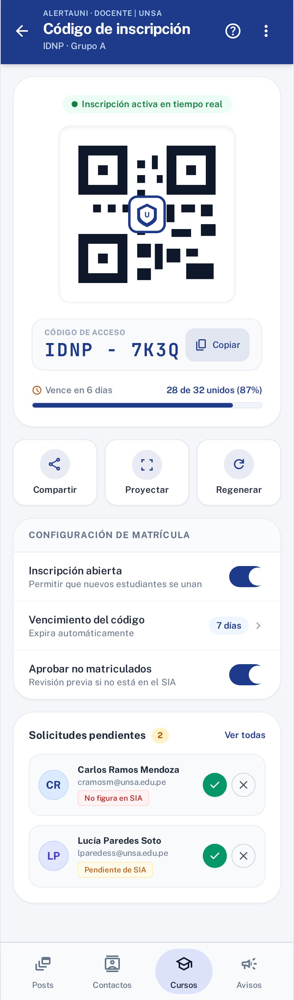
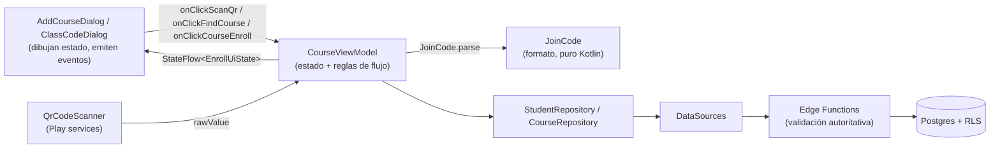

# Proyecto Integrador · Parte 1 — Incorporación de estudiantes a un curso

**Curso:** Introducción al Desarrollo de Nuevas Plataformas (E) · 2026B
**Aplicación:** AlertaUNI (Android · Jetpack Compose · Hilt · Supabase)
**Tema:** Diseño del proceso de incorporación de estudiantes a un curso

---

## 1. Contexto y problema

AlertaUNI es un espacio de comunicación académica exclusivo entre el docente y los estudiantes de un curso, separado de los contactos y conversaciones personales (a diferencia de WhatsApp). Para que ese espacio funcione, **sólo las personas correctas deben entrar a cada curso**, y el ingreso tiene que ser rápido: normalmente ocurre durante los primeros minutos de la primera clase, con 30 a 60 estudiantes al mismo tiempo.

En el proyecto base este proceso estaba incompleto:
- Existía la búsqueda por **código de clase** (`service-find-course-catalog`) y la inscripción (`service-course-enroll`), pero sin retroalimentación de errores, sin control de vencimiento y **sin validar si el estudiante está matriculado**: cualquiera que conociera el código podía entrar.
- El docente no tenía forma de ver ni compartir el código desde la app.

**Necesidades identificadas**

| Actor | Necesidad | Restricción |
|---|---|---|
| Estudiante | Unirse en segundos, sin escribir códigos largos | Puede equivocarse al tipear (0/O, 1/I); puede no tener buena conexión en el aula |
| Docente | Que ingresen sólo sus estudiantes, sin tener que agregarlos uno por uno | Tiene poco tiempo en clase; algunos alumnos se matriculan tarde o no figuran aún en la lista oficial |
| Institución | Que el espacio sea privado del curso | Los datos de estudiantes no deben exponerse a terceros |

### Aplicaciones similares analizadas

| Aplicación | Mecanismo | Aprendizaje para AlertaUNI |
|---|---|---|
| **Google Classroom** | Código de clase (6–8 caracteres) + invitación por correo + enlace | El código es cómodo pero, si se filtra, cualquiera entra; Classroom permite **restablecer** y **desactivar** el código. → Incluir regenerar y cerrar inscripción. |
| **Microsoft Teams (Educación)** | Código de equipo o agregar miembros desde la lista | Agregar desde la lista es seguro pero laborioso para el docente. → Usar la lista para **validar automáticamente**, no para cargar manualmente. |
| **Moodle** | Automatriculación con **clave** y fecha límite | La clave con vencimiento reduce el riesgo de filtración. → Código con **vencimiento** (7 días). |
| **Kahoot / Mentimeter** | PIN + **QR proyectado** en el aula | En clase presencial el QR es lo más rápido para muchos alumnos a la vez. → El docente puede **proyectar** el QR. |
| **WhatsApp (grupos)** | Enlace de invitación | Sin control de quién entra; mezcla lo personal con lo académico. → Justifica un control de acceso más estricto. |

---

## 2. Evaluación de alternativas (4.1)

Alternativas consideradas: **(a)** código QR, **(b)** código alfanumérico, **(c)** invitación directa del docente desde la lista de matriculados, y **(d) propuesta híbrida**.

### Matriz de decisión ponderada

Escala 1 (muy desfavorable) a 5 (muy favorable). Los pesos priorizan el **control de acceso** y la **seguridad**, porque el propósito de la app es un espacio exclusivo del curso.

| Criterio | Peso | (a) QR | (b) Código | (c) Invitación | (d) Híbrida |
|---|---:|:---:|:---:|:---:|:---:|
| Facilidad de uso (general) | 0.15 | 5 | 3 | 4 | 5 |
| Posibilidad de errores (5 = pocos) | 0.15 | 5 | 2 | 4 | 5 |
| Control del acceso al curso | 0.20 | 2 | 2 | 5 | 5 |
| Seguridad | 0.15 | 3 | 2 | 5 | 4 |
| Facilidad para el docente | 0.10 | 4 | 5 | 2 | 4 |
| Facilidad para el estudiante | 0.10 | 5 | 3 | 5 | 5 |
| Viabilidad en Android | 0.15 | 4 | 5 | 3 | 4 |
| **Puntaje ponderado** | **1.00** | **3.90** | **2.95** | **4.05** | **4.60** |

**Criterios de puntuación usados**
- *Posibilidad de errores*: QR = el usuario no escribe nada; código = errores de tipeo frecuentes (0/O, 1/I, guiones); invitación = errores sólo si el correo en la lista está mal.
- *Control del acceso*: QR y código **por sí solos** dejan entrar a cualquiera que los obtenga (foto del QR compartida en un grupo); la invitación sólo admite a la lista.
- *Facilidad para el docente*: la invitación exige seleccionar o cargar estudiantes y hacer seguimiento a quienes no aceptan.
- *Viabilidad Android*: el código es un `TextField`; el QR requiere escáner (resuelto con Google code scanner, que depende de Play services); la invitación requiere notificaciones push y gestión de listas.

### Ventajas y limitaciones

| Alternativa | Ventajas | Limitaciones |
|---|---|---|
| (a) QR | Instantáneo; sin errores de tipeo; ideal para proyectar en clase | Si el alumno no está en el aula no puede escanear; una foto del QR se puede reenviar; requiere cámara/Play services |
| (b) Código | Funciona a distancia (correo, aula virtual); implementación simple | Errores de tipeo; se filtra fácilmente; sin control de quién entra |
| (c) Invitación | Máximo control; el alumno sólo acepta | Carga operativa del docente; depende de que la lista esté actualizada; alumnos matriculados tarde quedan fuera |

### Alternativa seleccionada: mecanismo híbrido

> **El QR y el código alfanumérico transportan el mismo token** (`alertauni://join?code=IDNP-7K3Q`). El estudiante elige escanear o escribir, y el servidor **valida contra la lista oficial de matriculados**: si figura, entra de inmediato; si no, queda en **"pendiente de aprobación"** y el docente acepta o rechaza.

**Justificación**
1. **Rapidez del QR** en el aula y **alcance del código** fuera de ella, con una sola validación en el servidor (un único endpoint, un único formato).
2. **Control de la invitación sin su costo operativo**: la lista se usa como filtro automático; el docente sólo interviene en los casos excepcionales (matrícula tardía, traslados).
3. **Mitiga la filtración**: aunque el QR circule, un externo no entra sin aprobación. Además el código **vence** (7 días), se puede **regenerar** y la inscripción se puede **cerrar**.
4. **Reduce errores**: el código generado evita caracteres ambiguos (sin 0/O/1/I/L) y la app valida el formato antes de llamar al servidor.
5. **Es viable** con la arquitectura actual: reutiliza `service-find-course-catalog`, `course_catalog.class_code` y `class_code_enable` que ya existían.

---

## 3. Flujo de registro (4.2)

### Flujo completo (actividad con carriles)

### Respuestas a lo que pide el enunciado

| Punto del flujo | Diseño |
|---|---|
| **Cómo inicia** | Estudiante: pestaña *Cursos* → botón **+**. Docente: tarjeta del curso → **Código de inscripción** (lo muestra, proyecta o comparte). |
| **Qué información proporciona / recibe el estudiante** | Proporciona el código (escaneado o escrito); su identidad (email institucional) la aporta la sesión de Google, no la escribe. Recibe: código, nombre del curso, docente, tipo, grupo, semestre y, al final, el resultado. |
| **Acciones del docente** | Ver/proyectar/copiar/compartir el código; **regenerarlo**; **abrir/cerrar** la inscripción; **aprobar o rechazar** solicitudes de no matriculados. |
| **Cómo se valida** | 1) En la app: formato con `JoinCode.parse` y "ya registrado" contra la lista local. 2) En el servidor: código existente, inscripción abierta y **no vencida**, alumno no inscrito, rol = estudiante, y **pertenencia a `course_roster`**. |
| **Registro exitoso** | Se inserta en `student_enrollment`, la lista de cursos se recarga, se muestra "Registro exitoso" y un Snackbar; el alumno ya ve los anuncios del curso. |
| **Error o no completado** | Código inválido (formato o inexistente/cerrado), ya registrado, pendiente de aprobación, error de red con **Reintentar** (sin perder el curso encontrado), escáner no disponible → ingreso manual. |

### Estados de la interfaz (máquina de estados)

---

## 4. Prototipo de interfaces (4.3)

Diseñado en **Google Stitch** con el sistema de diseño de la app (Material 3, primario `#1E3A8A`, esquinas 8 dp) y exportable a **Figma** (ver §8). Se diseñaron **sólo las pantallas y estados del proceso de incorporación**, no toda la aplicación.

Proyecto Stitch: *"AlertaUNI – Incorporación a curso (Proyecto 01)"*. Capturas en [`stitch/`](stitch/).

| # | Pantalla / estado | Situación del enunciado | Captura |
|---|---|---|---|
| 01 | Unirse a un curso (inicial: QR o código) | Ingreso de información | *en el proyecto Stitch* |
| 09 | Escáner QR + verificando | Espera o procesamiento | *en el proyecto Stitch* |
| 02 | Confirmar inscripción (curso encontrado, matriculado) | Ingreso / confirmación |  |
| 03 | Código inválido | Código inválido |  |
| 04 | Ya estás registrado (bottom sheet) | Estudiante ya registrado |  |
| 05 | Solicitud pendiente de aprobación | No matriculado (validación) |  |
| 06 | Registro exitoso | Registro exitoso |  |
| 07 | Error de red al confirmar | Error durante el proceso |  |
| 08 | Docente: código de inscripción (QR, compartir, abrir/cerrar, solicitudes) | Acciones del docente |  |

**Decisiones de UX**
- El QR es la **acción principal** (tarjeta destacada) y el código es la alternativa: el QR elimina errores de tipeo.
- Los errores se muestran **junto al campo** (`isError` + texto de soporte) y con **sugerencias concretas** (confusión 0/O, código vencido, probar con QR).
- "Ya registrado" usa un **bottom sheet informativo** (no es un error) con acceso directo al curso.
- "Pendiente" usa un **stepper** para que el estudiante entienda que el proceso continúa y quién debe actuar.
- El error de red conserva el curso encontrado y ofrece **Reintentar** (no obliga a empezar de nuevo).

---

## 5. Recursos de Android y Jetpack Compose (4.4)

| Recurso | Función | Dónde se usa | Por qué es apropiado | Restricciones / limitaciones |
|---|---|---|---|---|
| **`sealed class EnrollUiState`** | Modelar todos los estados del proceso | `CourseViewModel` → `AddCourseDialog` | Estados mutuamente excluyentes; el `when` exhaustivo obliga a representar cada uno en la UI (misma lista que las pantallas de Figma) | Agregar un estado exige actualizar la UI (el compilador lo señala) |
| **`ViewModel` + `StateFlow`** (`@HiltViewModel`) | Fuente única de verdad; lógica de validación y llamadas | `CourseViewModel` | Sobrevive a rotaciones; separa la lógica de la UI; testeable | El estado no sobrevive a la muerte del proceso (aceptable: se vuelve a `Idle`) |
| **`collectAsState()`** | Convertir el flujo en estado de Compose | `StudentCourseScreen` | Recomposición automática y sólo cuando cambia el estado | – |
| **`rememberSaveable`** | Texto del código y diálogo abierto | `AddCourseDialog`, `StudentCourseScreen` | Conserva lo escrito tras rotación o cambio de app | Sólo tipos guardables en `Bundle` |
| **Eventos como lambdas** (UDF) | `onClickFindCourse`, `onClickScanQr`, `onClickCourseEnroll`, `onRegenerate`… | Diálogos → ViewModel | La UI no conoce repositorios; permite `@Preview` con lambdas vacías | – |
| **`AlertDialog`, `TextField(isError)`, `KeyboardOptions(imeAction = Search, capitalization = Characters)`** | Ingreso y validación visual del código | `AddCourseDialog` | Componentes Material 3 estándar; acción "buscar" en el teclado; mayúsculas para códigos | La capitalización es sugerencia del teclado |
| **`CircularProgressIndicator`, `Snackbar`** | Espera y confirmación | Diálogo y pantalla de cursos | Retroalimentación no bloqueante | – |
| **Google code scanner** (`play-services-code-scanner`, `GmsBarcodeScanning`) | Leer el QR | `screen/utils/QrCodeScanner.kt` | **No requiere permiso de cámara** ni implementar visor: la UI la provee Play services; menor código y superficie de errores | Requiere Google Play services; el módulo se descarga (se declara `com.google.mlkit.vision.DEPENDENCIES = barcode_ui` para anticiparlo). Alternativa descartada: **CameraX + ML Kit**, más control visual pero exige permiso `CAMERA`, manejo del ciclo de vida de la cámara y más código |
| **ZXing (`QRCodeWriter`)** | Generar el QR del docente | `ClassCodeDialog.generateQrBitmap` | Ya era dependencia del proyecto; genera el QR localmente sin red | El bitmap se genera en el hilo de UI; se memoriza con `remember(qrContent)` para no recalcularlo en cada recomposición |
| **`LocalClipboardManager`, `Intent.ACTION_SEND`** | Copiar y compartir el código | `ClassCodeDialog` | Reutiliza apps del sistema (correo, aula virtual) sin integrar SDKs | – |
| **`Switch`, `FilledTonalButton`** | Abrir/cerrar inscripción, regenerar | `ClassCodeDialog` | Controles Material 3 para ajustes binarios y acciones secundarias | – |
| **`JoinCode` (dominio)** | Formato único del código y del QR; validación | `domain/course/JoinCode.kt` | Una sola regla para QR y texto; pura Kotlin → **pruebas unitarias JVM** | – |
| **Repositorio + DataSource** (`StudentRepository`, `CourseRepository`) | Acceso a Edge Functions | `data/` | Mantiene la arquitectura existente; `Result<T>` y `BackendException` para errores de negocio | – |
| **Supabase Edge Functions + RLS** | Validación autoritativa | `service-course-enroll`, `service-course-class-code`, migración SQL | La validación de pertenencia y vencimiento **debe** ocurrir en el servidor; RLS restringe qué filas ve cada usuario | Los errores de negocio se devuelven con estado 404/401 para que `safeInvoke` los convierta en `BackendException` |
| **Navegación** | No se agregan rutas: el flujo ocurre en diálogos dentro de la pestaña *Cursos* | `MainMenuScreen` | Mantiene el contexto; el FAB sólo aparece para el estudiante | Un flujo más largo podría migrar a rutas dedicadas |

---

## 6. Prototipo en Jetpack Compose (4.5)

Parte implementada: **ingreso y validación del código, escaneo de QR, representación de todos los estados, confirmación del registro y la vista del docente para compartir el código**.

| Archivo | Contenido |
|---|---|
| `domain/course/JoinCode.kt` | Formato `alertauni://join?code=…`, `parse()` y `toQrContent()` |
| `test/.../JoinCodeTest.kt` | 5 pruebas unitarias (código escrito, QR, parámetros extra, QR ajenos, entradas inválidas) |
| `screen/course/CourseViewModel.kt` | `EnrollUiState` (9 estados) y `ClassCodeUiState`; `findCourse`, `onQrScanned`, `courseEnroll`, `openClassCode`, `regenerateClassCode`, `setEnrollmentOpen` |
| `screen/course/AddCourseDialog.kt` | Diálogo del estudiante: botón *Escanear código QR*, campo con validación, resumen del curso, mensajes por estado; **7 `@Preview`** |
| `screen/course/ClassCodeDialog.kt` | Diálogo del docente: QR (ZXing), código, copiar, compartir, regenerar, abrir/cerrar; **2 `@Preview`** |
| `screen/course/StudentCourseScreen.kt` | Conecta ViewModel, escáner y diálogos; botón *Código de inscripción* en la tarjeta del curso (sólo docente) |
| `screen/utils/QrCodeScanner.kt` | Envoltura del Google code scanner |
| `data/...` | `ClassCodeInfo`, `ClassCodeActionRequest`, `CourseEnrollResponse.status`, `CourseDataSource.callClassCodeEndpoint`, `CourseRepository.classCode` |
| `Backend/supabase/migrations/20260930000000_proyecto01_incorporacion.sql` | `class_code_expires_at`, `course_roster`, `enrollment_request`, políticas RLS |
| `Backend/supabase/functions/service-course-enroll` | Validación completa y respuesta `ENROLLED` / `PENDING` |
| `Backend/supabase/functions/service-course-class-code` | GET / REGENERATE / OPEN / CLOSE del código (sólo el docente del curso) |

**Separación de responsabilidades**

**Verificación**: `./gradlew :app:testDebugUnitTest` (5/5 pruebas OK) y `./gradlew :app:assembleDebug` (compila con Hilt y Room). La ejecución contra el backend real requiere las credenciales de Supabase/Firebase, que no están en el repositorio base.

---

## 7. Decisiones técnicas principales

| # | Decisión | Alternativas descartadas | Motivo |
|---|---|---|---|
| DT1 | **Mismo token en QR y código** | QR con token distinto al código | Una sola validación y un solo endpoint; el QR es sólo un atajo de entrada |
| DT2 | **Validación contra `course_roster` en el servidor** | Validar sólo en la app | La app es manipulable; la pertenencia al curso es una regla de seguridad |
| DT3 | **Estado "pendiente" en lugar de rechazo** | Rechazar a no matriculados | Contempla matrículas tardías sin dejar entrar a externos |
| DT4 | **Google code scanner** | CameraX + ML Kit | Sin permiso de cámara, menos código; suficiente para leer un QR |
| DT5 | **Código con vencimiento, regenerable y cerrable** | Código permanente | Mitiga la filtración del QR/código (aprendizaje de Classroom y Moodle) |
| DT6 | **Alfabeto sin caracteres ambiguos** | Alfanumérico completo | Menos errores al dictar o escribir |
| DT7 | **Diálogos en la pestaña Cursos** | Nuevas rutas de navegación | Flujo corto; respeta la estructura de navegación existente |
| DT8 | **`sealed class` de estados = pantallas de Figma** | Varios `Boolean` (`isLoading`, `isError`…) | Trazabilidad directa diseño ↔ código y estados imposibles eliminados |

---

## 8. Relación Figma ↔ código y exportación

| Pantalla Stitch/Figma | Estado en código | `@Preview` |
|---|---|---|
| 01 Unirse (inicial) | `EnrollUiState.Idle` | `AddCourseDialogIdlePreview` |
| 09 Escáner / verificando | `QrCodeScanner` + `Searching` | – (UI de Play services) |
| 02 Confirmar inscripción | `CourseFound` | `AddCourseDialogFoundPreview` |
| 03 Código inválido | `NotFound` | `AddCourseDialogNotFoundPreview` |
| 04 Ya registrado | `AlreadyEnrolled` | `AddCourseDialogAlreadyEnrolledPreview` |
| 05 Pendiente de aprobación | `PendingApproval` | `AddCourseDialogPendingPreview` |
| 06 Registro exitoso | `Enrolled` | `AddCourseDialogEnrolledPreview` |
| 07 Error de red | `Error` | `AddCourseDialogErrorPreview` |
| 08 Docente: código | `ClassCodeUiState.Ready` | `ClassCodeDialogReadyPreview`, `ClassCodeDialogClosedPreview` |

**Exportar de Stitch a Figma**
1. Abrir el proyecto en [stitch.withgoogle.com](https://stitch.withgoogle.com) (*AlertaUNI – Incorporación a curso (Proyecto 01)*).
2. Seleccionar las pantallas → **Export** → **Figma** (o *Copy to Figma*).
3. En Figma, pegar en un archivo nuevo (con el plugin *Stitch to Figma* si lo solicita). Las capas quedan editables con Auto Layout.
4. Agregar el enlace del archivo de Figma en el README.

---

## 9. Guía de sustentación

- *¿Por qué híbrido y no sólo QR?* → El QR solo no controla el acceso (§2); la lista oficial sí, y "pendiente" cubre los casos excepcionales.
- *¿Dónde se valida el registro?* → Formato en la app (`JoinCode`), pertenencia y vigencia en el servidor (`service-course-enroll`).
- *¿Qué pasa si el alumno escanea un QR de otra cosa?* → `JoinCode.parse` lo rechaza: "El QR escaneado no corresponde a un curso de AlertaUNI" (probado en `JoinCodeTest`).
- *¿Por qué no pide permiso de cámara?* → El Google code scanner corre en Play services y devuelve sólo el texto leído.
- *¿Cómo se relaciona Figma con el código?* → Cada pantalla es un estado de `EnrollUiState` con su `@Preview` (§8).
- *¿Qué ocurre al rotar la pantalla a mitad del proceso?* → El estado vive en el ViewModel (`StateFlow`) y lo escrito en `rememberSaveable`.
